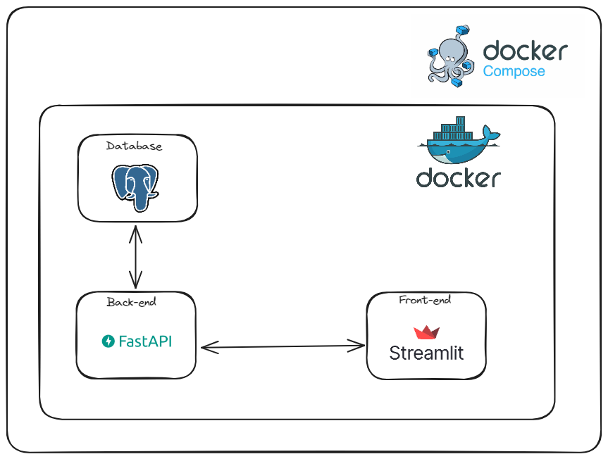
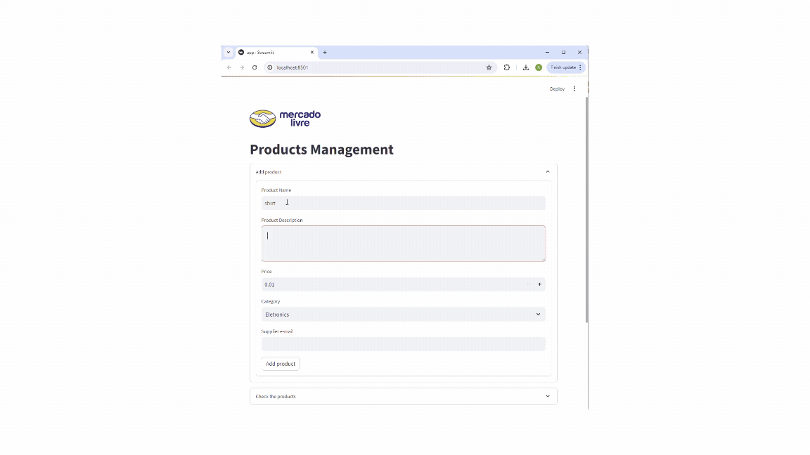

# Python API CRUD + Front-end
A CRUD to manage products, create new ones, edit, delete and get.
The project was done with Docker-compose, 3 containers are run: one for database with Postgres, one for the back-end with FastAPI and another for front-end with Streamlit.





## Clone the project and run on Docker
```bash
git clone https://github.com/robinsonlovatto/python-api-crud-front.git
cd python-api-crud-front

# running the containers
docker compose up --build

#removing the containers
docker compose down
```

## Front-end
```bash
http://localhost:8501/
```

